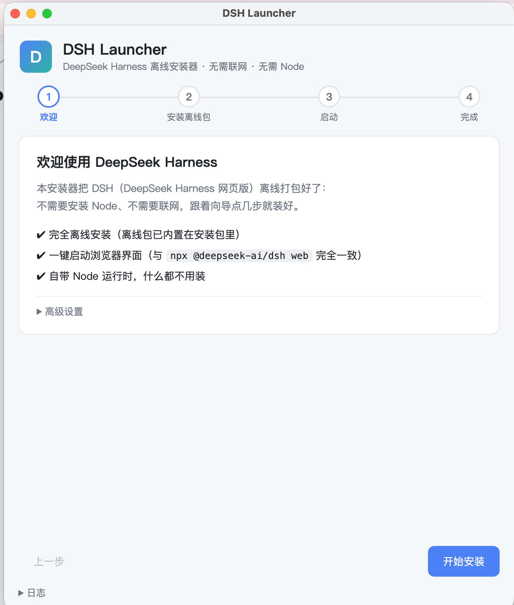
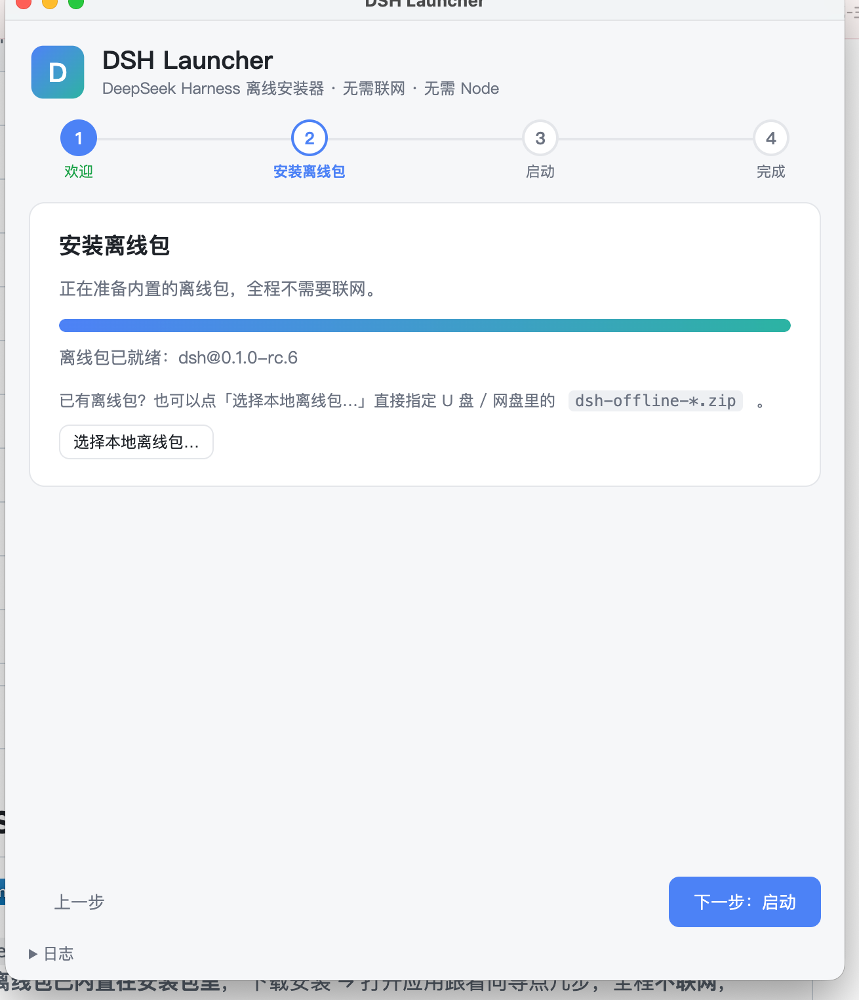
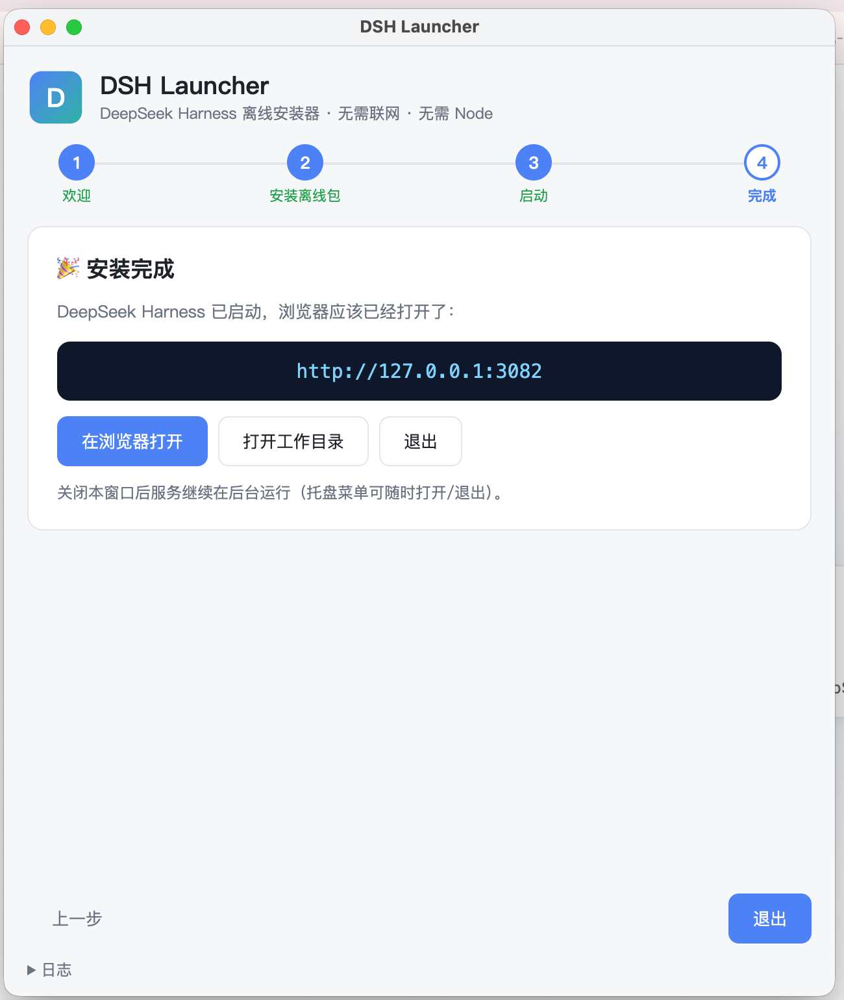

<div align="center">

# DSH Launcher

### DeepSeek Harness · 离线安装器

**零配置 · 纯离线 · 自带 Node · 一键启动 `dsh web`**

[](LICENSE)
[](https://github.com/dongdonglog/deepseek-dsh-download/releases/latest)
[](#-下载)


[**下载安装包**](https://github.com/dongdonglog/deepseek-dsh-download/releases/latest) · [**查看 Releases**](https://github.com/dongdonglog/deepseek-dsh-download/releases) · [**使用文档**](DEVELOPMENT.md)

</div>

---

## 这是什么

有些用户没法直接执行 `npx @deepseek-ai/dsh web` —— 没有 Node，或者 npm 网络不通，或者在企业受限网络中。

**DSH Launcher** 把 DeepSeek Harness (dsh) 的完整运行环境 **离线打包进安装包里**，下载 → 安装 → 跟着向导点几步，**全程零联网**，效果与 `npx @deepseek-ai/dsh web` 完全等价，**不用装 Node / 不用配 npm**。

- 离线包（DSH + Node 24 LTS + 完整依赖树，~100MB）已 **内嵌** 在安装包里
- 首次启动从安装包内 **本地解压** 离线包，不走任何网络
- 也支持「选择本地离线包 zip」—— 用 U 盘 / 网盘分发也行

---

## ✨ 特性

| | |
|---|---|
| 🎁 **完全离线** | 安装包自带离线包，全程不联网，装完即用 |
| 🚀 **一键启动** | 与 `npx @deepseek-ai/dsh web` **逐字等价**，开箱即用浏览器界面 |
| 🪶 **零依赖** | 自带 Node.js 24 LTS 运行时，用户机无需任何前置环境 |
| 🧭 **向导引导** | 4 步中文向导（欢迎 → 离线包 → 启动 → 完成），不踩坑 |
| 💾 **托盘常驻** | 关窗不退出，服务后台跑，托盘菜单随时打开 / 退出 |
| 🔁 **可升级 DSH** | 改一个版本号重发即可，应用启动时自动发现新离线包 |
| 🧰 **离线 / 在线双重安装** | 既能用内嵌离线包，也能指向 U 盘里的 `dsh-offline-*.zip` |
| 🌐 **多平台** | macOS (Apple Silicon / Intel) + Windows x64 |

---

## 📸 安装向导（4 步搞定）

### Step 1 · 欢迎

打开 **DSH Launcher**，先看到欢迎页。点 **「开始安装」** 进入下一步。



### Step 2 · 安装离线包

应用自动把内嵌的离线包解压到本地用户目录，全程不联网；也可点「**选择本地离线包…**」改用 U 盘 / 网盘里已有的 `dsh-offline-*.zip`。



### Step 3 · 启动（自动）

无需手动操作：应用自动起本地服务（默认 `http://127.0.0.1:3080`，被占用则顺延 3081 / 3082…），并自动拉起浏览器。

### Step 4 · 完成 ✅

DeepSeek Harness 已经跑起来了！可以直接 **「在浏览器打开」**、**「打开工作目录」** 或 **「退出」**。关闭窗口后服务仍在后台运行，托盘菜单可随时打开 / 退出。



---

## 📦 下载

所有安装包发在 [**GitHub Releases**](https://github.com/dongdonglog/deepseek-dsh-download/releases/latest)。**安装包已内置对应平台的离线包（约 100MB），装完即用，无需再下载任何东西。**

| 平台 | 架构 | 安装包 |
|---|---|---|
| macOS | Apple Silicon (M1 / M2 / M3 / M4) | `DSH.Launcher-<版本>-arm64.dmg` |
| macOS | Intel | `DSH.Launcher-<版本>.dmg` |
| Windows | 64 位 | `DSH.Launcher.Setup.<版本>.exe`（另有免安装版 `DSH.Launcher-<版本>-win.zip`） |

> 内置：`@deepseek-ai/dsh 0.1.0-rc.6` + Node.js 24 LTS（最低 22.19，受 `node:zlib` zstd API 与 `node:sqlite` 限制）。
> 离线包 zip **单独发布** 在 Releases，可分发到 U 盘 / 网盘再用「选择本地离线包…」安装。

### 首次打开未签名应用的放行提示

- **macOS**：右键（或按住 Control 点击）应用图标 → **打开**；若提示「无法验证开发者」，到 *系统设置 → 隐私与安全性* → **仍要打开**。
- **Windows**：SmartScreen 提示时点 **更多信息 → 仍要运行**。

---

## 🚀 快速开始

```bash
# 1) 下载
#    macOS (Apple Silicon)  : DSH.Launcher-<版本>-arm64.dmg
#    macOS (Intel)          : DSH.Launcher-<版本>.dmg
#    Windows x64            : DSH.Launcher.Setup.<版本>.exe
#    Windows 免安装          : DSH.Launcher-<版本>-win.zip

# 2) 安装 → 拖入 Applications / 双击 exe

# 3) 启动 DSH Launcher，跟向导点 4 下，全自动
```

启动后浏览器会自动打开 DeepSeek Harness 界面（默认 `http://127.0.0.1:3080`）。关窗口 ≠ 退出，托盘菜单里有「打开界面 / 打开工作目录 / 退出」。

### 备用：用 U 盘 / 网盘里的离线包安装

如果内置离线包不可用（或者想用公司内部分发的特定版本），在「安装离线包」一步点 **「选择本地离线包…」**，指定 `dsh-offline-<平台>-<架构>-<版本>.zip` 即可，同样全程离线。

---

## 🔧 高级设置

点欢迎页的 **「高级设置」** 可调整：

- **工作目录**：DSH 的会话 / 产物保存位置（默认 `~/Library/Application Support/DSH Launcher/workspace` / Windows `%APPDATA%\DSH Launcher\workspace`）。
- **起始端口**：默认 `3080`，占用时自动顺延（`3081, 3082, …`），最多到 `65535`。

---

## ❓ 常见问题

<details>
<summary><b>提示「没有找到离线包」</b></summary>

下载最新版安装包重装；或点「选择本地离线包…」手动指定离线包 zip。
</details>

<details>
<summary><b>端口 3080 被占用</b></summary>

应用自动尝试 `3081, 3082, …`，也可以在高级设置里改成其他端口。
</details>

<details>
<summary><b>想换工作目录</b></summary>

高级设置 → 选择…（DSH 的会话 / 产物保存在工作目录下）。
</details>

<details>
<summary><b>想清理旧版本占用的磁盘</b></summary>

删除 `~/Library/Application Support/DSH Launcher/bundles/`（macOS）或 `%APPDATA%\DSH Launcher\bundles\`（Windows）里的旧目录，保留当前版本。
</details>

<details>
<summary><b>想升级 DSH 版本</b></summary>

下载新版本安装包重新安装即可（离线包随安装包更新）；下次启动会自动发现。
</details>

<details>
<summary><b>不联网能用吗？</b></summary>

完全可以。安装包内含完整 Node 24 LTS + dsh + 依赖树，启动过程不发起任何网络请求。
</details>

<details>
<summary><b>应用启动命令与 npx 启动等价吗？</b></summary>

等价。底层命令：`<bundle>/node/node <bundle>/app/node_modules/@deepseek-ai/dsh/lib/bin.js --profile web --port <N>`，参数与 `npx @deepseek-ai/dsh web` 一致。
</details>

---

## 🛠 技术栈

| 组件 | 选型 |
|---|---|
| 桌面壳 | [Electron](https://www.electronjs.org/)（macOS / Windows 二进制） |
| 安装向导 UI | 原生 HTML + CSS + JS，单页 4 步 |
| 进程模型 | Electron Main（窗口 / 托盘 / IPC）+ 纯 Node 子模块（可单测） |
| 离线包构建 | 纯 Node，无第三方依赖（`tools/build-offline.mjs`） |
| CI / CD | GitHub Actions（tag 触发，矩阵构建 + 自动发版） |
| 安装包 | `electron-builder`（macOS dmg / Windows nsis + zip） |
| 镜像回退 | GitHub / ghproxy / 自定义 npm 镜像（仅构建期使用） |

---

## 📂 目录结构

```
deepseek-dsh-download/
├── config.json                # 唯一配置源：owner / repo / dshVersion / nodeVersion / npmRegistry
├── tools/                     # 离线包构建 / 测试 / 发布（纯 Node，无第三方依赖）
│   ├── build-offline.mjs      # 构建离线包（含 sha256、清理无关平台原生包）
│   ├── sync-app-config.mjs    # config.json → app/local/bundle.json
│   ├── smoke.mjs              # 离线包冒烟测试（dump-config + 原生依赖加载）
│   ├── zipwriter.mjs          # 纯 Node zip 写入器（保留可执行位、UTF-8 文件名）
│   ├── test-app-local.mjs     # 应用纯 Node 模块的单元测试
│   ├── test-app-e2e.mjs       # 端到端测试（真实离线包：解压 → 启动 → 就绪）
│   └── release.mjs            # 发布引导脚本（npm run release）
├── app/                       # Electron 桌面应用（DSH Launcher）
│   ├── main.js                # 主进程：窗口 / 托盘 / IPC
│   ├── preload.js             # contextBridge 白名单
│   ├── renderer/              # 中文单页 UI（4 步向导）
│   │   ├── index.html
│   │   ├── renderer.js
│   │   └── style.css
│   └── local/                 # 纯 Node 模块（settings / downloader / launcher / runner）
├── docs/
│   └── screenshots/           # README 引用的向导截图
├── .github/workflows/
│   └── release.yml            # 推 tag → 自动构建 + 发布
├── offline/                   # 本地构建产物（gitignore）
├── package.json
├── README.md
└── DEVELOPMENT.md             # 开发者文档（构建 / 调试 / 发布）
```

---

## 🛠 开发者 / 构建离线包

构建工具、CI 发布流程、本地测试、调试技巧见 [**DEVELOPMENT.md**](DEVELOPMENT.md)。

下面是常用命令速查：

```bash
# 构建当前平台/架构的离线包（默认从 config.json 读 registry）
node tools/build-offline.mjs --platform darwin --arch arm64

# 冒烟测试（解压后验证 node / dsh boot / 原生模块）
rm -rf /tmp/bundle && mkdir -p /tmp/bundle
unzip -q offline/dsh-offline-darwin-arm64-0.1.0-rc.6.zip -d /tmp/bundle
node tools/smoke.mjs /tmp/bundle

# 应用纯 Node 模块单元测试
node tools/test-app-local.mjs

# 端到端测试（真实离线包，spawn 真 dsh web）
node tools/test-app-e2e.mjs --bundle-zip offline/dsh-offline-darwin-arm64-0.1.0-rc.6.zip

# 运行桌面应用（开发模式）
cd app && npm install && npm start
```

---

## 🚀 发布新版（维护者）

**懒人流程：打一个 tag 推送，构建 + 发布全自动**。

### 方式一：一条命令（推荐）

```bash
npm run release
```

脚本一步步引导：检查登录 / 仓库 / 工作区 → 选版本号 → 确认内容 → 打 tag 推送 → 等待构建完成 → 给出发布地址。

### 方式二：手动推 tag

```bash
git tag v1.1.0
git push origin v1.1.0
```

推送后 GitHub Actions 自动完成：
1. 矩阵并行构建 3 个平台离线包（含冒烟测试）
2. **把对应平台的离线包内嵌进安装包**
3. 构建 macOS dmg / Windows exe + zip
4. 全部成功后 draft Release 转正发布

> **升级 DSH 版本**：改 `config.json` 的 `dshVersion` 再发布即可，不需要动应用代码；用户下次启动会自动发现新离线包（**无需重装应用本体**）。

---

## 🗺 Roadmap / 已知限制

- ✅ macOS arm64 / x64 + Windows x64
- ⏳ Windows ARM64（未打包）
- ⏳ 应用安装包代码签名（macOS Gatekeeper / Windows SmartScreen 需用户放行）
- ⏳ 应用自身自动更新（依赖代码签名）
- ✅ 内置离线包自动升级（无需重装应用）
- ⏳ Linux（暂未规划）
- ⏳ DeepSeek Harness 新版本首发同步

---

## 🤝 贡献

欢迎 PR / Issue！但请先读 [DEVELOPMENT.md](DEVELOPMENT.md) 了解构建链路。

- **Bug 反馈**：[Issues](https://github.com/dongdonglog/deepseek-dsh-download/issues)
- **功能建议**：[Discussions](https://github.com/dongdonglog/deepseek-dsh-download/discussions)
- **DSH 本体的 issue**：请到上游 [@deepseek-ai/dsh](https://github.com/deepseek-ai) 仓库反馈

代码贡献流程：

```bash
git clone https://github.com/dongdonglog/deepseek-dsh-download.git
cd deepseek-dsh-download
node tools/build-offline.mjs --platform darwin --arch arm64   # 构建离线包
cd app && npm install && npm start                            # 开发模式启动
```

---

## 🔒 安全说明

- 安装包 **未做代码签名**，首次打开会有系统放行提示（macOS / Windows 的标准行为）。
- 应用只在以下场景发起网络请求：构建期下载 Node 运行时（CI 阶段，已加 GitHub + ghproxy + npmmirror 自动回退），以及从 GitHub Releases 拉取新版本离线包（用户主动升级时）。
- 启动 DSH **不会** 主动外联任何网络。

---

## 📄 许可

MIT © [dongdonglog](https://github.com/dongdonglog)。DeepSeek Harness 本体版权归其各自作者所有。

---

## 🙏 致谢

- [DeepSeek](https://github.com/deepseek-ai) —— 原始的 DSH / DeepSeek Harness 项目
- [Electron](https://www.electronjs.org/) —— 桌面壳
- [electron-builder](https://www.electron.build/) —— 安装包打包
- [npmmirror](https://registry.npmmirror.com) / [ghproxy](https://ghproxy.com) —— 国内友好的镜像源

<div align="center">

如果这个项目帮到了你，欢迎点个 ⭐️ —— 这是维护者继续迭代的最大动力。

</div>
